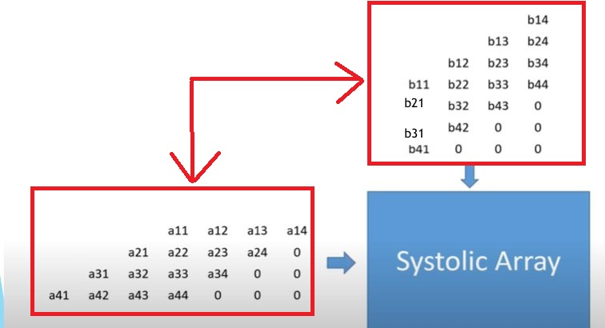
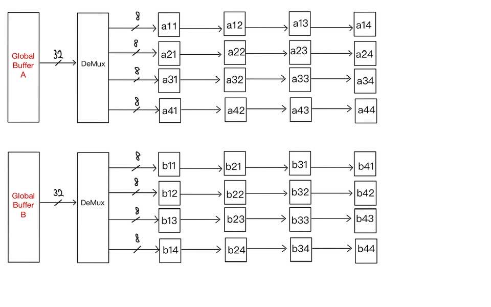
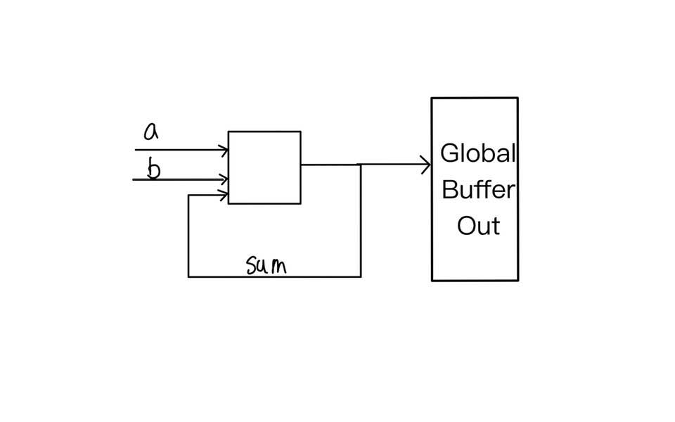
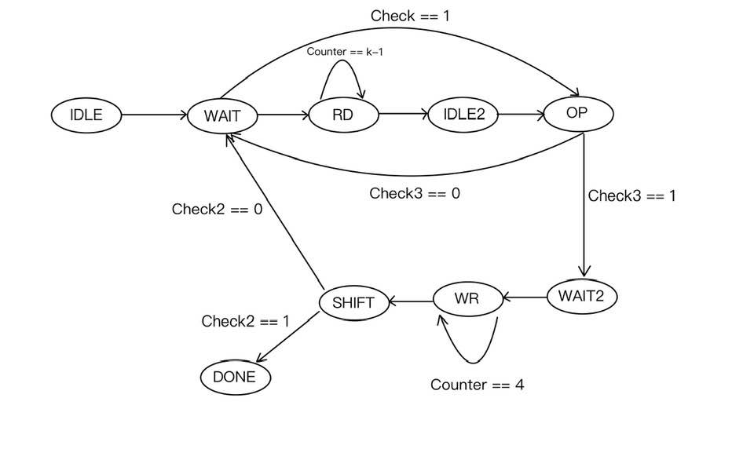
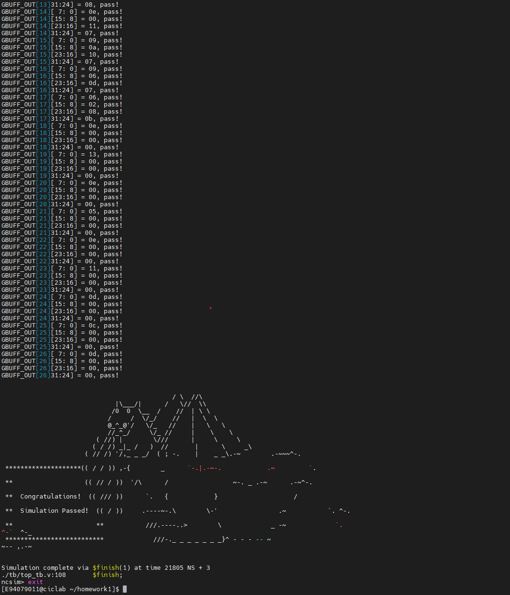
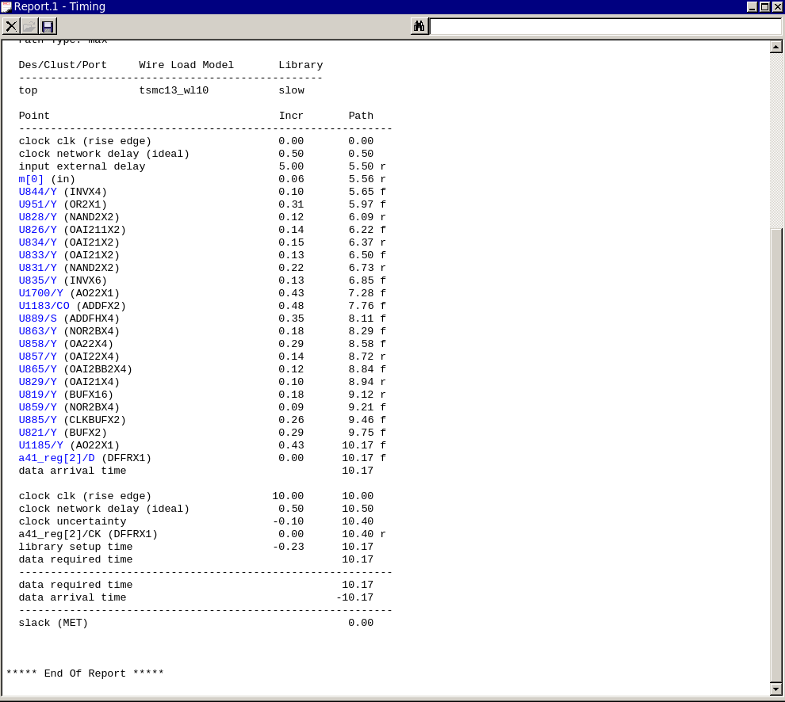
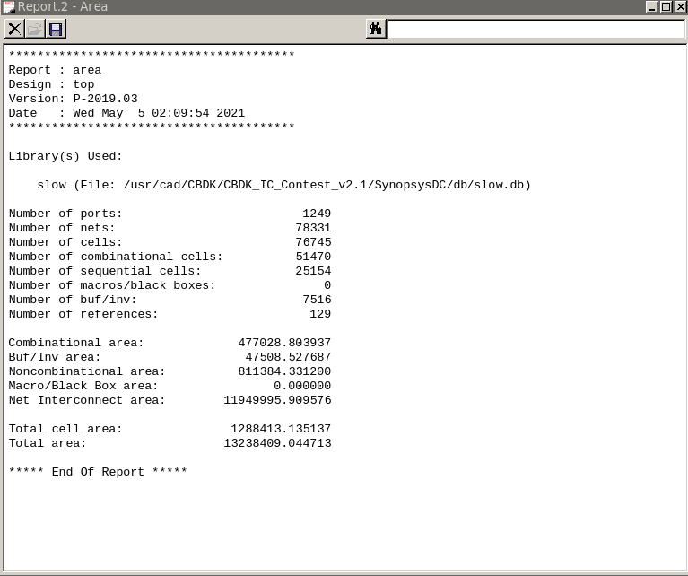

# AIC2021 Project1 - TPU
###### tags: `aic2021` 

## Student ID 
姓名:黃柏惟  
學號:E94079011  
系級:工科110  

## Todo
- [x] tb1~3
- [x] Readme
- [x] Monster
- [x] Synthesis

## 設計說明
這次設計考量到計算單元內的儲存空間較為珍貴，因此為了節省TPU內的Area面積我將設計每次都會向Buffer讀取k次取出當下cycle要push進PE的值。
透過systolic array 的排列方式將讀取得值在計算完後push到下一個PE的運算單元。舉例來說此次讀取出一個值後會放入a11隨後push到a12、a13、a14以此類推。  
另外，由於注意到了buffer_a與buffer_b可以同時讀取因此採用2d的systolic array。
### 優點
* 可以節省為了達到systolic array外掛的儲存空間，下圖中的紅色區域我都不需要花費空間儲存。

### 缺點
* 會花較多時間讀取Buffer。

## Architecture
### Systolic Array
讀進來的值會在Demux後按照systolic array要求來排列等待脈動。

### PE
PE的運算會將相同數字的a,b進行相乘後與上一次運算的結果相加，待運算結束後輸出到global_buffer_o。

## Finite State Machine

### 狀態機說明

#### IDLE
idle
#### WAIT
整個運算的開頭，會在這邊檢查是否已經將所有的值讀入PE若非則會進到RD狀態進行讀值，若已經完成讀值則會跳過整個RD的的狀態直接重複PE計算與Push的動作可以節省很多cycle。
#### RD
總共花k個cycle將此次要進行運算的值放入systolic array的頭。
#### IDLE2
Read完成後等待數據到達並且將參數調整。
#### OP
計算PE的值
#### WAIT2
進到此狀態表示PE已經將所有狀態都運算完畢。
#### WR
開始寫入global_buffer_o，共花四個cycle。
#### SHIFT
根據傳入的MNK判斷是否達成所有矩陣的運算若非則回到WAIT繼續運算。
#### DONE
done

### 相關參數說明

#### Big_sum
首先會比較M與N的大小並且存入big，接著會與K相加存入Big_sum，此wire的用意在於RD階段最多會讀取到Big_sum長度的資料。
#### counter
RD階段的counter。
#### counter2
Push階段的counter。
#### counter3
計算M*N需要多少個block計算。
#### check
當資料全部讀完後check拉高。
#### check2
當counter3==總共所需要的block後拉高進入DONE。
#### check3
check拉高後需要再4個cycle等待PE內的資料脈動出去。

## Monster 測資通過
以兩個9 * 9 最大的測資通過截圖為證

## Synthesis
有附上合成完成後的ddc。
### Timing report
slack為0

### Area report
因為有將global buffer三個區塊的area算進去因此總面積較大。

